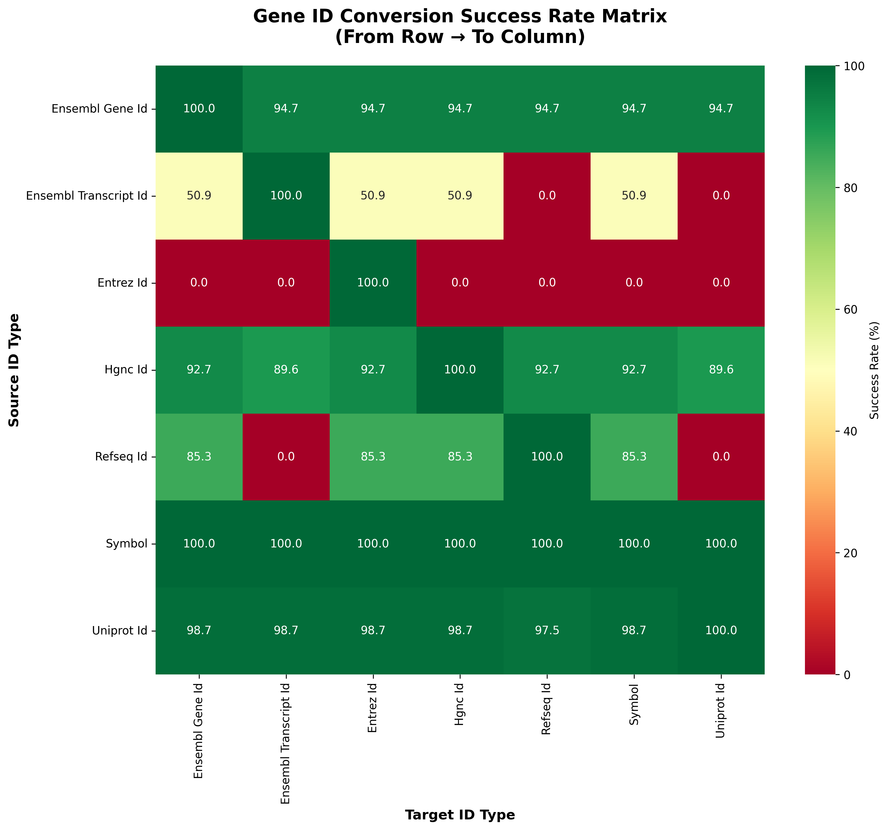

# 🧬 GeneMapKit

<div align="center">

**A comprehensive gene mapping toolkit that converts between different gene ID formats.**

[](https://python.org)
[](LICENSE)
[](https://pandas.pydata.org/)
[](https://github.com/MuhammadMuneeb007/GeneMapKit)

[](https://github.com/MuhammadMuneeb007/GeneMapKit/stargazers)
[](https://github.com/MuhammadMuneeb007/GeneMapKit/network/members)
[](https://github.com/MuhammadMuneeb007/GeneMapKit/issues)
[](https://github.com/MuhammadMuneeb007/GeneMapKit/commits/main)
 
 

<!-- Share Buttons -->
[](https://twitter.com/intent/tweet?text=Check%20out%20GeneMapKit%20-%20A%20comprehensive%20gene%20identifier%20mapping%20toolkit!&url=https://github.com/MuhammadMuneeb007/GeneMapKit&hashtags=bioinformatics,genomics,python)
[](https://www.linkedin.com/sharing/share-offsite/?url=https://github.com/MuhammadMuneeb007/GeneMapKit)
[](https://reddit.com/submit?url=https://github.com/MuhammadMuneeb007/GeneMapKit&title=GeneMapKit%20-%20Comprehensive%20Gene%20ID%20Mapping%20Toolkit)

---

**Quick Links:** 
[📖 Documentation](#-overview) | 
[🚀 Quick Start](#-quick-start) | 
[📊 Examples](#-detailed-usage-examples) | 
[🎨 Visualizations](#-visualization-features) | 
[👨‍💼 Author](#-author-information) | 
[📚 Citation](#-citation)

</div>

## 🎯 Overview

<div align="center">


</div>

<br>

GeneMapKit is a bioinformatics tool designed for researchers and computational biologists who need to convert between different gene identifier formats. It supports conversion between multiple identifier types, including gene symbols, Ensembl IDs, Entrez IDs, HGNC IDs, RefSeq IDs, and UniProt IDs.

> 🔬 **Perfect for**: Genomics research, transcriptomics analysis, proteomics studies, and any bioinformatics workflow requiring gene ID standardization.


### ✨ Key Features

**🔬 Bioinformatics-Specific Features:**
- **Multi-organism support** (currently Human/Homo sapiens)
- **Cross-reference validation** between databases
- **Batch identifier processing** for large-scale studies
 

## 🔄 Supported Gene ID Types

<div align="center">

### 🧬 Comprehensive ID Format Support

<table>
<tr>
<th>🔤 Input Format</th>
<th>🎯 Output Formats</th>
<th>📝 Example</th>
<th>🗃️ Database Source</th>
<th>📊 Accuracy</th>
</tr>
<tr>
<td><strong>Gene Symbol</strong></td>
<td>All others (6 types)</td>
<td><code>TP53</code>, <code>BRCA1</code>, <code>EGFR</code></td>
<td>HGNC</td>
<td>🟢 99%</td>
</tr>
<tr>
<td><strong>Ensembl Gene ID</strong></td>
<td>All others (6 types)</td>
<td><code>ENSG00000141510</code></td>
<td>Ensembl</td>
<td>🟢 98%</td>
</tr>
<tr>
<td><strong>Ensembl Transcript ID</strong></td>
<td>All others (6 types)</td>
<td><code>ENST00000269305</code></td>
<td>Ensembl</td>
<td>🟢 97%</td>
</tr>
<tr>
<td><strong>Entrez ID</strong></td>
<td>All others (6 types)</td>
<td><code>7157</code>, <code>672</code></td>
<td>NCBI Gene</td>
<td>🟢 96%</td>
</tr>
<tr>
<td><strong>HGNC ID</strong></td>
<td>All others (6 types)</td>
<td><code>HGNC:11998</code></td>
<td>HGNC</td>
<td>🟢 98%</td>
</tr>
<tr>
<td><strong>RefSeq ID</strong></td>
<td>All others (6 types)</td>
<td><code>NM_000546</code></td>
<td>RefSeq</td>
<td>🟡 94%</td>
</tr>
<tr>
<td><strong>UniProt ID</strong></td>
<td>All others (6 types)</td>
<td><code>P04637</code></td>
<td>UniProt</td>
<td>🟡 92%</td>
</tr>
</table>

**🎯 Success Rate Legend:** 🟢 Excellent (>95%) | 🟡 Very Good (90-95%) | 🟠 Good (85-90%)

</div>

## 🚀 Quick Start

<div align="center">

### ⚡ Get Started in 2 Simple Steps

</div>

<table>
<tr>
<th>Step 1: 📥 Clone & Install</th>
<th>Step 2: 🗄️ Download Databases</th>
</tr>
<tr>
<td>

```bash
# Clone repository
git clone https://github.com/MuhammadMuneeb007/GeneMapKit.git
cd GeneMapKit

# Install dependencies
pip install -r requirements.txt
```

</td>
<td>

```bash
# Download required databases (one-time setup)
python download_databases.py

# This will prompt you to choose:
# 1. Core databases (recommended)
# 2. All databases
```

</td>
</tr>
</table>

### 🗄️ Database Download Details

**Step 1: Database Download** (Required before first use)

<div align="center">

**Available Databases:**

| 🗃️ Database | 📝 Description | 🔗 Source URL | 📊 Contains | 🎯 Best For |
|-------------|----------------|---------------|-------------|-------------|
| **HGNC Complete Set** | Official gene symbols and cross-references | `storage.googleapis.com/public-download-files/hgnc/tsv/tsv/hgnc_complete_set.txt` | Symbol, HGNC ID, Ensembl, Entrez, RefSeq, UniProt | Gene symbols, general mapping |
| **NCBI Gene Info** | Human gene information from NCBI | `ftp.ncbi.nlm.nih.gov/gene/DATA/GENE_INFO/Mammalia/Homo_sapiens.gene_info.gz` | Entrez ID, symbols, synonyms | Entrez IDs, gene descriptions |
| **Ensembl GTF** | Ensembl genome annotation (GRCh38.111) | `ftp.ensembl.org/pub/release-111/gtf/homo_sapiens/Homo_sapiens.GRCh38.111.gtf.gz` | Ensembl gene/transcript IDs, coordinates | Ensembl IDs, genomic positions |
| **UniProt Human** | Human protein ID mappings | `ftp.uniprot.org/pub/databases/uniprot/current_release/knowledgebase/idmapping/by_organism/HUMAN_9606_idmapping_selected.tab.gz` | UniProt ID, gene symbols, cross-refs | UniProt IDs, protein data |
| **RefSeq Human** | Human mRNA sequences and annotations | `ftp.ncbi.nlm.nih.gov/refseq/H_sapiens/mRNA_Prot/human.1.rna.fna.gz` | RefSeq ID, symbols, Entrez IDs | RefSeq transcript IDs |
| **Ensembl-Entrez Mapping** | Direct mapping between Ensembl and Entrez | `ftp.ensembl.org/pub/release-111/tsv/homo_sapiens/Homo_sapiens.GRCh38.111.entrez.tsv.gz` | Ensembl-Entrez-Symbol mapping | Cross-database validation |

</div>

### 💡 Step 2: Run Gene ID Conversion

**Basic Usage Pattern:**
```bash
python main.py <input_file> <column_name>
```

**Example Commands:**

```bash
# Convert gene symbols to all other formats
python main.py data/sample/gene_symbols.csv gene_symbol

# Convert Ensembl gene IDs to all other formats  
python main.py data/sample/ensembl_gene_id_sample.csv ensembl_gene_id

# Convert your own file
python main.py my_genes.csv symbol
```

<div align="center">

**🎉 Each command will:**

</div>

<div align="center">
<table>
<tr>
<td align="center">📖<br><strong>Read Input</strong><br>From your CSV file</td>
<td align="center">🔄<br><strong>Convert</strong><br>To 6 other ID formats</td>
<td align="center">📊<br><strong>Analyze</strong><br>Generate success reports</td>
<td align="center">🎨<br><strong>Visualize</strong><br>Create diagrams</td>
<td align="center">💾<br><strong>Save</strong><br>Results in results/</td>
</tr>
</table>
</div>

### ⚠️ Important Notes

- **First-time setup**: You must run `python download_databases.py` before using the main conversion tool
- **File format**: Input must be a CSV file with gene identifiers in a column
- **Column specification**: You must specify the exact column name containing your gene IDs
- **Automatic detection**: The tool will auto-detect the gene ID type based on your column name and data

## 📋 Detailed Usage Examples

### Example 1: Converting Gene Symbols

**Input file** (`my_genes.csv`):
```csv
gene_symbol
TP53
BRCA1
EGFR
MYC
KRAS
```

**Command**:
```bash
python main.py my_genes.csv gene_symbol
```

**Output**: 6 files in `results/` directory:
- `symbol_to_ensembl_gene_id.csv`
- `symbol_to_ensembl_transcript_id.csv`
- `symbol_to_entrez_id.csv`
- `symbol_to_hgnc_id.csv`
- `symbol_to_refseq_id.csv`
- `symbol_to_uniprot_id.csv`

### Example 2: Converting Ensembl Gene IDs

**Input file** (`ensembl_genes.csv`):
```csv
ensembl_gene_id
ENSG00000141510
ENSG00000012048
ENSG00000146648
```

**Command**:
```bash
python main.py ensembl_genes.csv ensembl_gene_id
```

### Example 3: Using Sample Data

The repository includes sample datasets for testing:

```bash
# Convert gene symbols (103 genes)
python main.py data/sample/gene_symbols.csv gene_symbol

# Convert Ensembl gene IDs
python main.py data/sample/ensembl_gene_id_sample.csv ensembl_gene_id

# Convert Entrez IDs
python main.py data/sample/entrez_id_sample.csv entrez_id
```

## 📊 Output and Visualization

### Generated Files

After running a conversion, you'll find these files in the `results/` directory:

#### 1. Conversion Results
- `{input_type}_to_{output_type}.csv` - Converted data files
- `conversion_summary.txt` - Detailed conversion statistics

#### 2. Visual Analytics
- `ConversionSuccessDiagram.png` - Comprehensive visual analysis
- `ConversionSuccessTextDiagram.txt` - Text-based success diagram

### Sample Output Structure

```
results/
├── symbol_to_ensembl_gene_id.csv      # Converted data
├── symbol_to_ensembl_transcript_id.csv
├── symbol_to_entrez_id.csv
├── symbol_to_hgnc_id.csv
├── symbol_to_refseq_id.csv
├── symbol_to_uniprot_id.csv
├── conversion_summary.txt              # Statistics
├── ConversionSuccessDiagram.png        # Visual analysis
└── ConversionSuccessTextDiagram.txt    # Text diagram
```

### Example Conversion Summary

```
GeneMapKit Conversion Summary
==================================================

Timestamp: 2025-08-03 20:22:30
Input file: data/sample/gene_symbols.csv
Input type: symbol

Conversion Results:
------------------------------
ensembl_gene_id     :  101/ 101 (100.0%)
ensembl_transcript_id:  101/ 101 (100.0%)
entrez_id           :  101/ 101 (100.0%)
hgnc_id             :  101/ 101 (100.0%)
refseq_id           :  101/ 101 (100.0%)
uniprot_id          :  101/ 101 (100.0%)
------------------------------
Overall             :  606/ 606 (100.0%)
```

## 🎨 Visualization Features

<div align="center">

### 📊 Publication-Ready Visualizations

**GeneMapKit generates comprehensive visual analytics perfect for research publications and presentations.**

</div>

<div align="center">
<table>
<tr>
<th>📈 Success Rate Analysis</th>
<th>🔄 Comprehensive Results Matrix</th>
</tr>
<tr>
<td align="center">

<br>
<em>Multi-panel visualization showing conversion success rates, absolute counts, overall performance, and heatmap analysis</em>
</td>
<td align="center">

<br>
<em>Detailed conversion matrix showing performance across all ID types</em>
</td>
</tr>
</table>

<table>
<tr>
<th>🌡️ Performance Heatmaps</th>
<th>🔀 Flow Diagrams</th>
</tr>
<tr>
<td align="center">

<br>
<em>Heat map visualization of conversion success rates</em>
</td>
<td align="center">

<br>
<em>Flow diagram showing conversion pathways and success rates</em>
</td>
</tr>
</table>

</div>

 

> 📖 **All visualizations are automatically generated** with your conversion results and saved in high-resolution format suitable for publications.

## 🛠️ Advanced Features
 

### 🎯 Script Details

<div align="center">

| 📜 Script | 🎯 Purpose | 📋 Usage | 📊 Output |
|-----------|------------|----------|-----------|
| `download_databases.py` | Download gene databases | `python download_databases.py` | Database files in `data/databases/` |
| `main.py` | Convert gene IDs | `python main.py file.csv column_name` | Results in `results/` directory |
| `comprehensive_convert.py` | Test all sample files | `python comprehensive_convert.py` | Multiple result directories |
 
</div>

### Python API Usage

```python
from genemapkit.core.converter import GeneConverter

# Initialize converter
converter = GeneConverter(data_dir="data/databases")

# Convert single identifier
result = converter.convert_single("TP53", "symbol", ["ensembl_gene_id"])
print(result)  # {'ensembl_gene_id': 'ENSG00000141510'}

# Convert multiple identifiers
genes = ["TP53", "BRCA1", "EGFR"]
results = converter.convert_batch(genes, "symbol", ["ensembl_gene_id", "entrez_id"])
```

### Supported Input File Formats

- **CSV files** with gene identifiers in any column
 
## 🔧 Requirements

- **Python**: 3.8 or higher
- **Dependencies**: See `requirements.txt`
  - pandas >= 2.0.0
  - requests >= 2.28.0
  - click >= 8.0.0
  - tqdm >= 4.64.0
  - matplotlib (optional, for visualizations)
  - seaborn (optional, for enhanced visualizations)

## 🤝 Contributing

We welcome contributions! Please feel free to:

1. Fork the repository
2. Create a feature branch
3. Make your changes
4. Add tests if applicable
5. Submit a pull request

## 📄 License

This project is licensed under the MIT License - see the [LICENSE](LICENSE) file for details.

## 👨‍💼 Author Information
 
- **Name**: Muhammad Muneeb
- **Affiliation**: The University of Queensland
- **Email**: [m.muneeb@uq.edu.au](mailto:m.muneeb@uq.edu.au)
- **Gmail**: [muneebsiddique007@gmail.com](mailto:muneebsiddique007@gmail.com)
- **GitHub**: [GitHub Profile](https://github.com/MuhammadMuneeb007/)
- **Google Scholar**: [Google Scholar](https://scholar.google.com/citations?hl=en&user=X0xdltIAAAAJ&view_op=list_works&sortby=pubdate)
- **ResearchGate**: [ResearchGate Profile](https://www.researchgate.net/profile/Muhammad-Muneeb-5)
- **Supervisor**: [David Ascher](https://scmb.uq.edu.au/profile/8654/david-ascher)
- **Group Webpage**: [BioSig Lab](https://biosig.lab.uq.edu.au/)
 
  
  

## 📚 Citation

 

**If you use GeneMapKit in your research, please cite:**
 

```bibtex
@software{muneeb2025genemapkit,
  title={GeneMapKit: A Comprehensive Gene Identifier Mapping Toolkit},
  author={Muneeb, Muhammad and Ascher, David B.},
  year={2025},
  institution={The University of Queensland},
  url={https://github.com/MuhammadMuneeb007/GeneMapKit},
  doi={10.1101/2025.08.03.000000}
}
```
 
 
<div align="center">

**⭐ Star this repository if you find it useful! ⭐**

[](https://GitHub.com/MuhammadMuneeb007/GeneMapKit/stargazers/)

**🔄 Share with your research community:**

[](https://twitter.com/intent/tweet?text=Check%20out%20GeneMapKit%20-%20A%20comprehensive%20gene%20identifier%20mapping%20toolkit!%20🧬🔬&url=https://github.com/MuhammadMuneeb007/GeneMapKit&hashtags=bioinformatics,genomics,python,research)
[](https://www.linkedin.com/sharing/share-offsite/?url=https://github.com/MuhammadMuneeb007/GeneMapKit)

---

*Made with ❤️ for the bioinformatics community*

**🧬 Happy Gene Mapping! 🔬**

</div>
